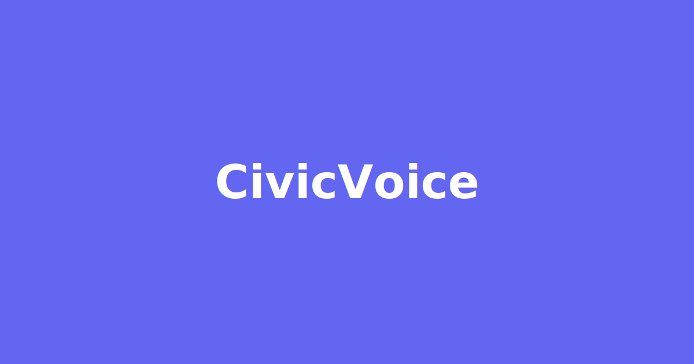

# CivicVoice



**CivicVoice** is a modern, AI-powered web application that allows citizens to report, track, and view resolutions of civic issues in their neighborhood. It streamlines the entire process from submission to resolution, fostering transparency and community engagement.

This project is built with a modern frontend stack including **React**, **TypeScript**, and **Tailwind CSS**, powered by **Vite**. It leverages the **Google Gemini API** for AI-powered features and the **Google Maps Platform** for geolocation and interactive maps.

---

## ✨ Key Features

This application provides a role-based experience tailored to Citizens, Admins, and Workers.

### For Citizens
*   **AI-Powered Issue Reporting**: Describe an issue, upload photos, and pinpoint the location on a map. Our Google Gemini integration automatically suggests a concise title and categorizes the report (e.g., Pothole, Graffiti, Streetlight).
*   **Interactive Map**: Use an interactive Google Map to precisely place your issue report. You can use your device's current location or search for an address.
*   **Personal Dashboard**: View all your reported issues in a clean, card-based layout. Track their status from 'Pending' to 'Resolved'.
*   **Filter & Search**: Easily filter your reports by status or search for a specific issue by its unique ID.
*   **Dual View Modes**: Toggle between a standard list view and an interactive map view that shows all unresolved issues in your area, including your own location.
*   **Detailed Issue Tracking**: Click on any issue to see a full detail view, including all comments, photos, and status history.
*   **Confirm & Rate**: Once a worker marks an issue as complete, you can confirm the resolution and provide a 1-5 star rating to give feedback on the service.
*   **Direct Communication**: Add comments to your issue reports to communicate directly with the assigned worker or an administrator.
*   **AI Chatbot Assistant**: A friendly chatbot is available to quickly check the status of any of your reported issues by simply providing the issue ID.

### For Admins
*   **Comprehensive Admin Dashboard**: Get a complete overview of all issues reported across the platform.
*   **Full Issue Control**: Update the status of any issue (e.g., mark as 'In Progress') or re-assign it to a different worker at any time.
*   **User Management**: Access a dedicated page to view all registered users and their roles.
*   **Create New Users**: Onboard new 'Worker' or 'Service' level users. When creating a worker, you can set their default location on a map to optimize automatic assignments.

### For Workers
*   **Personalized Work Queue**: The worker dashboard shows a filtered list of only the issues that are currently assigned to you.
*   **Task Management**: Update the status of your assigned issues as you work on them, from 'In Progress' to 'For Review' when the job is done.
*   **Location Management**: Update your own work location in your profile. This location is used by the system to automatically assign you the nearest new reports.

### Platform Features
*   **Secure Authentication**: A complete login and registration system for all user roles.
*   **Role-Based Access**: The UI and available actions dynamically change based on whether you are a Citizen, Worker, or Admin.
*   **Fully Responsive Design**: A clean, modern UI built with Tailwind CSS that works seamlessly on desktop and mobile devices.
*   **Backend Abstraction Layer**: Architected to seamlessly switch between a local `localStorage` mock backend and a live remote backend by changing a single environment variable.

---

## 🛠️ Technology Stack

*   **Frontend**: React, TypeScript, Tailwind CSS
*   **Build Tool**: Vite
*   **Generative AI**: Google Gemini API (`gemini-2.5-flash`) for AI-powered issue categorization and title generation.
*   **Maps & Geolocation**: Google Maps Platform
    *   **Maps JavaScript API**: For interactive map modals and static map previews.
    *   **Geocoding API**: For converting search queries into coordinates.
*   **Backend Simulation**: Browser `localStorage` to mock a persistent database for users and issues.

---

## 🚀 Getting Started

Follow these instructions to get a local copy up and running for development and testing purposes.

### Prerequisites

*   [Node.js](https://nodejs.org/) (which includes npm) installed on your machine.
*   A modern web browser (Chrome, Firefox, Safari, Edge).

### Installation & Setup

1.  **Clone the Repository**
    ```sh
    git clone https://github.com/your-username/civic-issue-tracker.git
    cd civic-issue-tracker
    ```

2.  **Install Dependencies**
    ```sh
    npm install
    ```

3.  **Configure API Keys & Environment**
    Create a `.env` file in the root of the project to store your configuration.

    *   Create the file:
        ```sh
        touch .env
        ```
    *   Add the following content to your new `.env` file, replacing the placeholders with your actual keys. **Only include the variables you need for your setup.**

        ```env
        # --- REQUIRED FOR MOCK/LOCAL DEVELOPMENT ---
        # Used for the client-side Gemini calls in the mock API.
        VITE_GEMINI_API_KEY=YOUR_GEMINI_API_KEY
        
        # --- REQUIRED FOR BOTH MODES ---
        # Used for Google Maps integration.
        VITE_GOOGLE_MAPS_API_KEY=YOUR_GOOGLE_MAPS_API_KEY

        # --- OPTIONAL: FOR CONNECTING TO A REAL BACKEND ---
        # If this URL is present, the app will make live API calls instead of using the mock.
        VITE_API_BASE_URL=http://127.0.0.1:5000 
        ```

    *   **To get your keys:**
        *   **Google Gemini API Key**: Obtain an API key from [Google AI Studio](https://aistudio.google.com/app/apikey).
            *   **⚠️ IMPORTANT SECURITY NOTE:** When you create your Gemini API key in the Google Cloud Console, you will see security restriction options.
            *   **For Backend Use (Recommended):** If you are running the Gemini calls on your backend server (by setting `VITE_API_BASE_URL`), your Gemini API key **MUST NOT** have "Website restrictions" (HTTP referrer restrictions). Server-to-server requests do not have a browser "referer" and will be blocked, resulting in a `403 API_KEY_HTTP_REFERRER_BLOCKED` error. Instead, leave the key unrestricted or use IP address restrictions if applicable.
            *   **For Frontend Mock Use:** If you are only using the mock API (client-side calls), you **SHOULD** add "Website restrictions" to your key, listing your development URL (e.g., `localhost:5173`) and deployment URL (e.g., `your-app-name.vercel.app`).

        *   **Google Maps Platform API Key**:
            1.  Go to the [Google Cloud Console](https://console.cloud.google.com/) and create a new project.
            2.  Enable the following three (3) APIs for your project:
                *   **Maps JavaScript API**
                *   **Geocoding API**
                *   **Maps Static API**
            3.  Create a new API Key under "Credentials".
            4.  **Important**: For security, restrict your Maps API key to your development and production domains using "Website restrictions".

4.  **Run the Application**
    Start the local development server:
    ```sh
    npm run dev
    ```
    The application will be available at `http://localhost:5173` (or another port if 5173 is busy). By default, it will run using the mock `localStorage` backend.

---

## 🔌 Connecting to a Real Backend

This application is designed to connect to any backend that adheres to the defined API contract below. To switch from the mock `localStorage` mode to a live backend:

1.  **Set the Environment Variable**: Add `VITE_API_BASE_URL` to your `.env` file and set it to the URL of your running backend server (e.g., `http://localhost:5000` for a local Flask server, or your deployed API URL).
2.  **Restart the Development Server**: Stop and restart `npm run dev` for the new environment variable to be loaded.
3.  **Secure Gemini API Key**: When using a real backend, the `VITE_GEMINI_API_KEY` is no longer needed on the frontend. The backend server should handle all calls to the Gemini API. You should move the API key to your backend server's environment variables for security.

### API Contract for Backend Implementation

Your backend server (e.g., Python/Flask) must implement the following RESTful endpoints. Authentication is handled via Bearer Tokens (JWT).

#### Authentication (`/api/auth`)
*   `POST /api/auth/register`
    *   **Body**: `{ email, password, firstName, lastName, mobileNumber }`
    *   **Response**: `{ token: "jwt_token", user: { ...userObject } }`
*   `POST /api/auth/login`
    *   **Body**: `{ email, password }`
    *   **Response**: `{ token: "jwt_token", user: { ...userObject } }`

#### Users (`/api/users`)
*   `GET /api/users` (Admin only)
    *   **Response**: `[ { ...userObject }, ... ]`
*   `POST /api/users` (Admin only)
    *   **Body**: `{ email, password, firstName, lastName, mobileNumber, role, location? }`
    *   **Response**: `{ ...userObject }`
*   `GET /api/users/me` (Authenticated users)
    *   **Response**: `{ ...userObject }`
*   `PUT /api/users/me` (Authenticated users)
    *   **Body**: `{ firstName, lastName, mobileNumber }`
    *   **Response**: `{ ...userObject }`
*   `PUT /api/users/me/password` (Authenticated users)
    *   **Body**: `{ oldPassword, newPassword }`
    *   **Response**: `200 OK`
*   `PUT /api/users/me/location` (Authenticated users, mainly for Workers)
    *   **Body**: `{ lat, lng }`
    *   **Response**: `{ ...userObject }`

#### Issues (`/api/issues`)
*   `GET /api/issues` (Admin only)
    *   **Response**: `[ { ...issueObject }, ... ]`
*   `GET /api/issues/reported` (Citizen only)
    *   Returns issues reported by the authenticated citizen.
    *   **Response**: `[ { ...issueObject }, ... ]`
*   `GET /api/issues/assigned` (Worker only)
    *   Returns issues assigned to the authenticated worker.
    *   **Response**: `[ { ...issueObject }, ... ]`
*   `GET /api/issues/user/:identifier` (Service role only)
    *   Returns issues for a specific user by email or mobile.
    *   **Response**: `[ { ...issueObject }, ... ]`
*   `GET /api/issues/:id` (Authenticated users, with role-based access checks)
    *   **Response**: `{ ...issueObject }`
*   `POST /api/issues` (Authenticated users)
    *   **Body**: `FormData` containing `description` (string), `location` (JSON string `{"lat": number, "lng": number}`), and `photos` (file array).
    *   **Backend Logic**: The backend should receive this, call the Gemini API for categorization, find the nearest worker, and then create the issue in the database.
    *   **Response**: `{ ...issueObject }`
*   `POST /api/issues/:id/comments` (Authorized users)
    *   **Body**: `{ text: "comment_text" }`
    *   **Response**: `{ ...issueObject }`
*   `PUT /api/issues/:id/status` (Admin/Worker only)
    *   **Body**: `{ status: "NewStatus" }`
    *   **Response**: `{ ...issueObject }`
*   `PUT /api/issues/:id/assign` (Admin only)
    *   **Body**: `{ workerEmail: "worker@test.com" }`
    *   **Response**: `{ ...issueObject }`
*   `PUT /api/issues/:id/resolve` (Citizen who reported it only)
    *   **Body**: `{ rating: 5 }`
    *   **Response**: `{ ...issueObject }`

---

## Deployment

This project is configured for easy deployment on platforms like Vercel or Netlify.

1. Push your code to a Git repository (GitHub, GitLab, etc.).
2. Import the repository into your hosting provider.
3. Configure the environment variables (`VITE_GOOGLE_MAPS_API_KEY` and optionally `VITE_API_BASE_URL` if connecting to a deployed backend) in your provider's settings.
4. The build command is `npm run build` and the output directory is `dist`. This is usually detected automatically.
5. Deploy!
